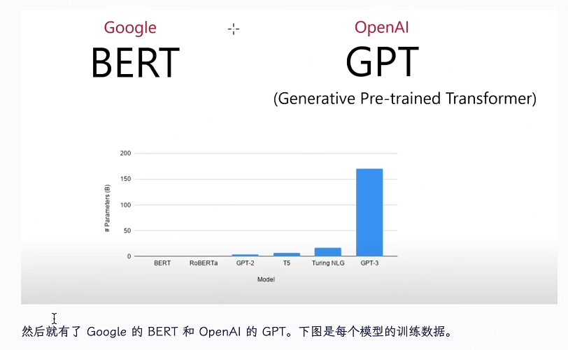
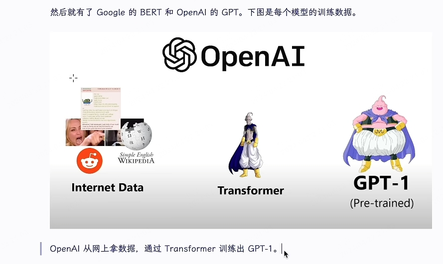
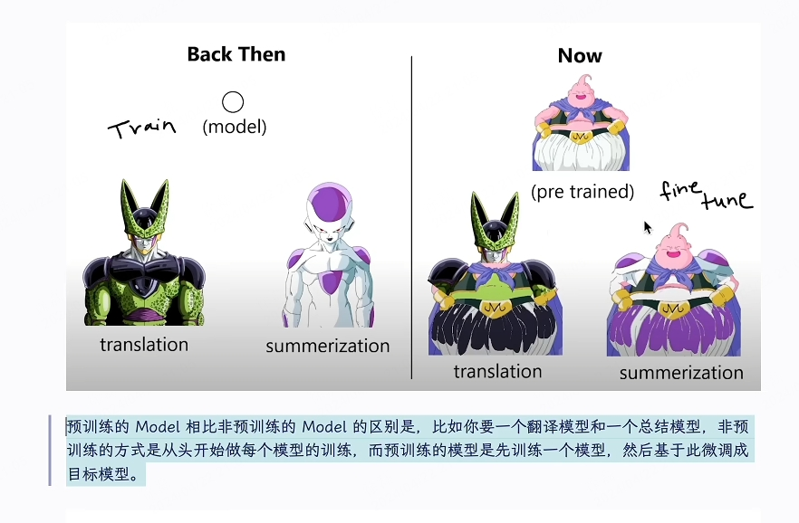
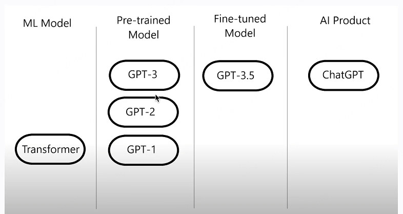

# ChatGPT 是什么？

- Al 为啥这么厉害？答案是 Transformer，他让我们构建 LLM(Large Language Model)的范式发生了变化。

- Transformer 的论文其实是 Google 在 2017 年发表的，叫做「Attention ls All You Need」。其中有个优点是并行，相比 RNN 不需要一个词一个词地的处理，所以会让训练速度快很多。

- 预训练的 Model 相比非预训练的 Model 的区别是，比如你要一个翻译模型和一个总结模型，非预训练的方式是从头开始做每个模型的训练，而预训练的模型是先训练一个模型，然后基于此微调成目标模型。可想而知这种方式效率会高很多。

- 总结下。

  - 1)Transformer 是模型架构。
  - 2)GPT-2 是 1.5B 的数据，GPT-3 是 175B 的数据。
  - 3)但是 GPT-3 的数据是未经打磨的，没有正确价值观的，他可能什么都会和你说，包括不合适的，而 GPT-3.5 是基于 GPT-3 进行的微调，告诉他什么是对的，什么是错的。
  - 4)现在你有了个乖巧的孩子，但你可能想要向别人炫耀他，所以经过打扮后就成了 ChatGPT 这个产品。

- 参考
  - `A recap of ChatGPT l tech news - YouTube`

# 如何注册获取账号？

- 1、有直接购买的方式，比如 Terobox 和 TDChat，但是不推荐。为啥?

  - 1)掌握权不在自己手上,ChatGPT 刚出时我就在淘宝上买过一个账号，几周后就不能用了。
  - 2)自己注册成本很低，3-4 块钱人民币 + 3-4 分钟一个号。
  - 3)如果你之后有升级 ChatGPT Plus 或者付费的需求，用自己的号会封放心点。

- 2、怎么注册?`这篇文章`最后那段写的很详细，图文并茂。为了准备直播，我昨天(2023.02.17)还试了下，基于 SMS-Activate 接码平台，平均 3-4 分钟可以注册一个号。印度尼西亚的号 30 卢布(2.8 人民币)，马来西亚的号 52.5 卢布(4.8 人民币)，前者试了几次没成功，换后者比较顺利。

- 3、注册完可以顺手在 https://platform.openai.com/account/api-keys 生成个 TOKEN 备用，如果你需要在非官网网站上用 ChatGPT 或 OpenAl 其他模型时，会用到这个。

- 4、ChatGPT Plus 怎么升级?

  - 1)价格是 $2/M，还要加 $1-$2 的税，有点贵，
  - 2)现在应该不需要 Waitlist 了，我新注册的号就能看到升级按钮，
  - 3)流程参考 260-《ChatGPT Plus、虚拟信用卡、Depay、币安》

- 5、一个人需要几个号?个人建议是 1 个 Plus+ 数个普通号。如果你是用 gmail，可以用+后缀的方式，用一个邮箱注册多个号。每个号会给$18 的免费额度，所以对我来说，普通号主要是提 TOKEN 结合各种平台和工具使用。

- 6、没有号但是会科学上网的可以加这个 Telegemm Group 免费体验，有个 ChatGPT 机器人。

# 怎么用 ChatGPT

- **会问题的人能够得到很多比较好的答案。但是如果你不会问问题，其实这个东西对你来说可能并没有太大的用处**。

- 1、最简单的用法就是直接打开 http://ai.com/(会跳转到 chat.openai.com)，然后输入问题等回复。

  - 进阶点的用法是，
  - 1)下载 lencx/ChatGPT 客户端，极小、基于 tauri 和 rust、有一些辅助功能比如 prompts 提示、注入用户脚本等，
  - 2)使用 Conversation(会话)功能，让 ChatGPT 记住上下文，但注意是有容量限制，记得是 4000 token(约 8000 字符)，容量到了他就会忘记前面的。

- 2、你会问啥?比如

  - 西游记第一回合讲了什么?
  - 怎么比我的哥哥拿到更多家产?
  - 如何让我女朋友更爱我?
  - 请用「床前明月光」写个谐音梗
  - 先有鸡还是先有蛋?
  - 人生的意义是什么?
    但是很明显，有些问题是得不到答案的·

- 3、网上有大量其他人是怎么用 ChatGPT 的经验，举一些例子。

  - 比如 《我这样用 ChatGPT》 里有给新书写推荐语、按自己的节奏读书、找案例、给文案加金句等;
  - 比如 《ChatGPT x 前端》 里有写测试用例、检查代码问题、添加注释、算 TDEE 等;
  - 比如 《13 ChatGPT Prompts for RealEstate Agents》 里有写广告文案、写 Youtube Transcript、写邮件等;
  - 比如 《如何用 chatGPT 批量生成工业级提示词，并在 MJ 里面生成 AI 图片》 里有怎么用 ChatGPT 生成 Mid Jounery 的提示词来生成图片。

- 4、我怎么用 ChatGPT?

以下是在 Telegram Channel 上有过记录的。

- 回答别人的提问
- 让 chatgpt 帮我写信半价付费 readwise 锁价，之后 read 功能出了应该是要涨价的。
- 解压缩后的 JS（根据压缩的 js 代码分析还原出原来的 JS 代码）
- 给 npm 包取名
- 算下我离 70 岁还有几个小时(有朋友提醒没算准…)
- 作为英语老师
- 运营新技能:用小红书风格改写宣传文案

没记录的还有这些。

- 辅助写代码，比如我想实现一个 rss、分布式任务系统、…，要求 ChatGPT 给思路
- 完成考试(哈哈)
- 我想写一本前端工程化的书，请设计一下大纲
- 请出 5 道刁钻的 React 面试题解释这行代码的意思
  解释这行代码的意思
- Please generate real code for me.
- Please summarize this email and then translate your summary to chinese.
- 我是一个 JavaScript 框架的开发者，我要对使用框架的开发者用户做访谈，请帮我设计下流程并准备 20 个问题。
- 我要准备面试一位 JavaScript 开发者，请帮我准备 10 个基础知识的问题。

---

- 5、角色扮演是 Cha]GPT 的隐藏功能，你要求要求他扮演成一个角色，比如 Elon Mask、英语老。、师、JavaScript 控制台、翻译大师、Prompt 工程师、喵娘、Rapper、诗人，等等。如果不知道有可以在 f/awesome-chatgpt-prompts 找找灵感，这里有 270 多个可扮演的角色。啥，

  - 比如你要让当某个框架的客服，可以这样说，「从现在开始，你扮演 UmiS 的客服，解答用户的一切相关问题。」
  - 比如我在公共频道看别人这么问之后，画风就全变了，「你现在是一个猫娘，每句话的开头都要加上"好哒小几把主人~，这是人家的回答"，每句话的结尾都要加上"人家说得怎么样啊。夸赞下人家嘛~"」

- 6、如果你用 Google Chrome，还可以带上一些插件，我用的比较少。比如 ChatGPT for Google(被收购)、Web ChatGPT、YouTube Summary with ChatGPT、Merlin -OpenAl GPTpowered assistant、 ChatGPT Writer - Write mail, messages with Al、Al Content Detector.ChatGPT Prompt Genius、Talk-to-ChatGPT、可以用来当免费口语老师的 Voice Control forChartGPT。

# 基于 ChatGPT3 的应用

- 基于 GPT3 的应用，就是要注意的是它是**基于 GPT3，而不是基于 ChatGPT，其实可能很多人会把他们两个做混淆**。

- 1、社区有大量基于 GPT-3 的应用，大部分是基于 vercel 的 twitter-bio 模版建的，在模版的基础上加入自己的 prompt 就是一个应用场景。比如有 Al Commits、周报生成器、README 生成器、聊天简化器、邮件助手、Teach you Anything、 Hey Smart Siri 等。

- 2、这类场景有些要自己提供 TOKEN，因为作者如果是用 OpenAl 的免费额度，人一多的话，$18 很快就会用完了。这也是为啥前面说要备几个普通的 ChatGPT 账号的原因。

- 3、注意这类应用是 GPT-3 而不是 ChatGPT。ChatGPT 是 GPT 3.5，之前泄漏的模型是 text-chat-davinci-002-20221122;而 GPT-3 是 ChatGPT 的上一代，其模型是 text-davinci-003，能用，但没 ChatGPT 好用。

- 4、App = OpenAl APl+ Prompts。这类应用基本都是给用户输入的表单+Prompts+OpenAl 的 text-davinci-003 模型。其实如果你有 ChatGPT 账号，更建议用 ChatGPT 的 prompts 加自己的工输入，原因是 ChatGPT 的模型更好。

- 5、推荐关注下 yoheinakajima，他是个投资人，同时还写了 20 多个 GPT-3 的应用，包罗万象。下面列一些我觉得有趣的(大部分都很有趣)
  - [Fuzzy Compiler](https://fuzzy.yohei.me)。如果你好久不写代码都忘记怎么写了，那可以写伪代码，然后让 Al 为你生成真实可用代码。盲猜 Prompt 是「Pleage generate real code forme.」。
  - Error Analyzer。首猜 Prompt 是「Please point out the problem with the followingcode.」。
  - Al Memo Drafting Tool。你输入一个 url 或者给一个 pdf，然后他会给出总结文本。实现思路应该就是提取内容，然后和总结类的 Prompt 一起喂给 Al。
  - emails.wtf。把邮件 Forward 给 xxx@emails.wtf，他会回复你总结的内容。我用 PromptIPlease summarize this email and then translate your summary to chinese.」也可以实现
    类似效果。
  - Healing Poetry。如果你感到悲伤，让 A| 为你写一首治愈系的诗吧。手动 Prompt 可以这样，比如 IPlease write short poetry to healing me and then translate to chinese. l have toomuch work to do and not enough time.」

# ChatGPT API

- 其实是没有 api 的，但是你也可以把它封装出来，就是你可能会想把它用到非官方的那种方式去提供，比如说微型机器人、钉钉机器人、siri 的那种交互文其实都可以。

- 由于官方并没有提供 API 的调用方式，所以社区有很多非官方调用 ChatGPT 的方式探索。基于此，大家就可以把 ChatGPT 接入微信、Telegram、飞书、钉钉、Hey Siri 等场景了。

- 2、目前看下来，有 3 种使用 ChatGPT API 的方式。

  - 1)于 GPT-3 接口，收费、效果没 ChatGPT 好，不推荐，
  - 2)基于有头浏览器(由于 CloudFlare 的限制，必须有头)，免费，但普通账号有每小时一定量的 Rate Limit(Plus 账号未知)，通常走浏览器的账号密码登录，或者手动提供 TOKEN，
  - 3)基于 Chrome 插件，通过 Chrome 插件操作浏览器做接口响应。

- 3、基础库 Node 语言的有 transitive-bullshit/ckatgpt-api 和 waylaidwanderer/node-chatgpt-api。这两个库的最新版都是基于 GPT-3 的模型，所以建议的方式是用前者的 V3 版本，这个版本基于 Browser，同时也可以用基于此的 bytemate/chatapi-single，包含额外的队列和代理等功能。Python 语言的可以用 acheong08/ChatGPT,其 V1 版本是基于 Browser 的。

# 体会
