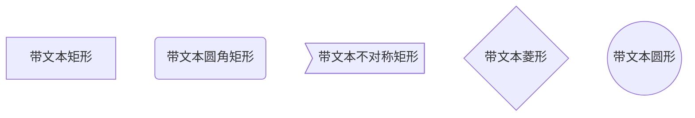
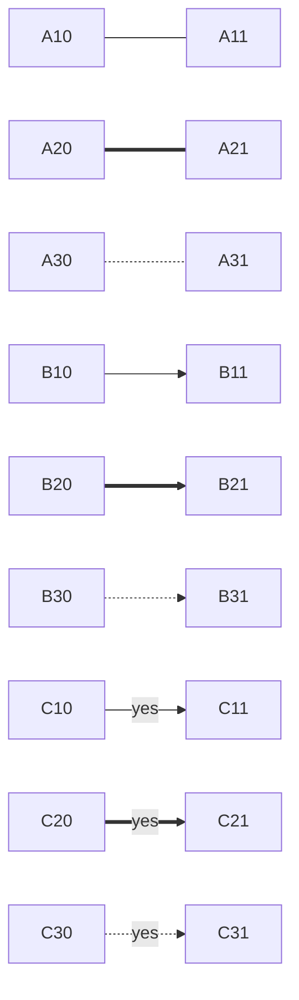
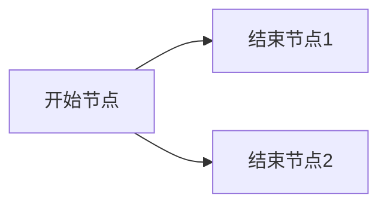
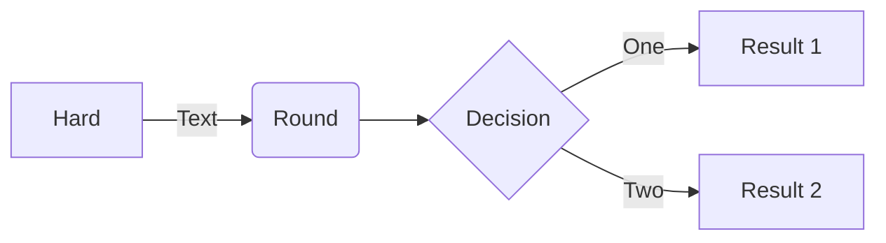
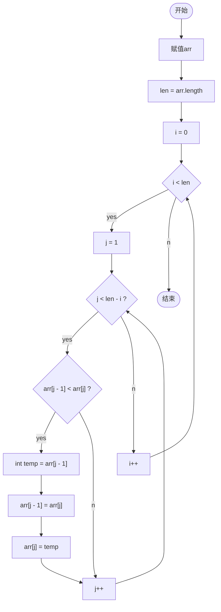
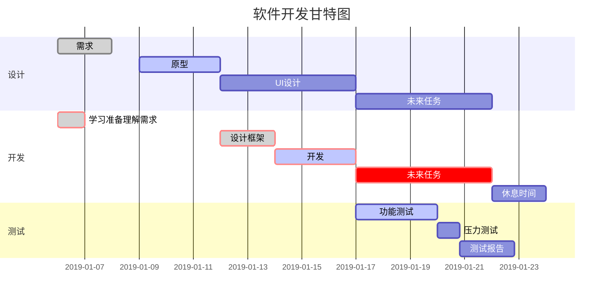
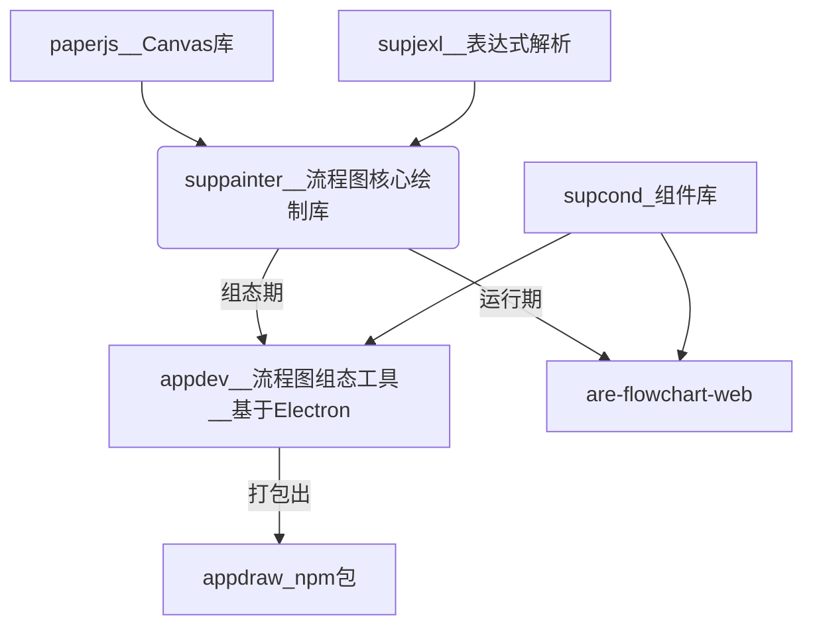

# `Mermaid`介绍

> **Mermaid 允许你使用文本和代码创建图表和可视化。**
> 它是一个基于 JavaScript 的图表绘制工具，可渲染 Markdown 启发的文本定义以动态创建和修改图表。

Mermaid 是一种**轻量级的、基于文本的图表绘制语法和工具，它允许开发者和技术专业人员通过简单的文本描述来创建图表，这种方法避开了复杂的图形编辑器，让图表的创建和代码一样容易被版本控制系统管理**。Mermaid 由 Knut Sveidqvist 于 2014 年创立，并迅速在技术社区中获得了广泛的认可，因为它解决了在文档中嵌入可维护图表的痛点问题。

Mermaid **支持多种图表类型，包括流程图（Flowchart）、序列图（Sequence Diagram）、甘特图（Gantt Diagram）、类图（Class Diagram）、状态图（State Diagram）等。这些图表广泛应用于软件设计、项目管理、系统建模等领域。例如，开发者可以使用流程图来描述一个算法的执行流程，或者用序列图来展示系统组件间的交互**。

使用 Mermaid 的一个典型例子是，==**在 Markdown 文件中嵌入图表代码。由于 Markdown 本身支持文本格式，结合 Mermaid，用户可以在同一个文件中编写文档和绘制图表，非常适合编写技术文档和手册。此外，Mermaid 的图表代码简洁明了，易于理解和修改，这对于团队协作和文档维护来说是一个巨大的优势**==。

Mermaid 的**另一个亮点是它可以集成到各种文档工具和平台，如 GitLab、GitHub、Confluence 等，这使得在这些平台上直接渲染 Mermaid 图表成为可能**。此外，Mermaid 还提供了一个在线编辑器，用户可以在不安装任何工具的情况下快速创建和预览图表。

然而，**Mermaid 并不是万能的。它虽然在简单性和易用性方面表现出色，但在复杂图表的定制性和美观性上可能无法与专业的图表绘制工具相媲美**。例如，当图表元素特别多或者需要高度定制风格时，Mermaid 的限制可能就会显现出来。

总的来说，==**Mermaid 为那些希望以代码形式快速生成和维护图表的用户提供了一个非常实用的解决方案。它以其独特的方式降低了制图的门槛，使得不擅长图形设计的技术人员也能轻松创建出清晰的图表来支撑他们的工作**==。

Mermaid 的语法简单直观，对于熟悉 Markdown 的用户来说，学习成本较低。它支持多种图表类型，每种类型都有其特定的语法规则。例如，流程图（Flowchart）的基本语法如下：

# 流程图 (`Flowchart`)

> - **流程图由节点（几何形状）和边（箭头或线）组成**。
> - `Mermaid` 代码**定义了如何创建节点和边，并适应不同的箭头类型、多向箭头以及与子图之间的任何链接**。

## graph 流程图







### 实例





## 流程图，时序图

```flow
start=>start: 接收到消息
info=>operation: 读取信息
setCache=>operation: 更新缓存
end=>end: 处理结束

start->info->setCache->end
```

```flow
st=>start: Start
op=>operation: Your Operation
cond=>condition: Yes or No?
e=>end
st->op->cond
cond(yes)->e
cond(no)->op
```

```flow
start=>start: API请求
cache=>operation: 读取Redis缓存
cached=>condition: 是否有缓存？
sendMq=>operation: 发送MQ，后台服务更新缓存info=>operation: 读取信息
setCache=>operation: 保存缓存
end=>end: 返回信息

start->cache->cached
cached(yes)->sendMq
cached(no)->info
info->setCache
setCache->end
sendMq->end
```

```flow
st=>start: Start|past:>http://www.google.com[blank]e=>end: End:>http://www.google.com
op1=>operation: get_hotel_ids|past
op2=>operation: get_proxy|current
sub1=>subroutine: get_proxy|current
op3=>operation: save_comment|current
op4=>operation: set_sentiment|current
op5=>operation: set_record|current

cond1=>condition: ids_remain空?
cond2=>condition: proxy_list空?
cond3=>condition: ids_got空?
cond4=>condition: 爬取成功??
cond5=>condition: ids_remain空?

io1=>inputoutput: ids-remain
io2=>inputoutput: proxy_list
io3=>inputoutput: ids-got

st->op1(right)->io1->cond1
cond1(yes)->sub1->io2->cond2
cond2(no)->op3
cond2(yes)->sub1
cond1(no)->op3->cond4
cond4(yes)->io3->cond3
cond4(no)->io1
cond3(no)->op4
cond3(yes, right)->cond5
cond5(yes)->op5
cond5(no)->cond3
op5->e
```

## 时序图示例

```sequence
Title:时序图示例
客户端->服务端: 我想找你拿下数据 SYN
服务端-->客户端: 我收到你的请求啦 ACK+SYN
客户端->>服务端: 我收到你的确认啦，我们开始通信吧 ACK
Note right of 服务端: 我是一个服务端
Note left of 客户端: 我是一个客户端
Note over 服务端,客户端: TCP 三次握手
participant 观察者
```

## UML 时序图示例

```sequence
客户端->打印机: 打印请求(id)
打印机->数据库:请求数据(id)
Note right of 数据库: 执行SQL获取数据
数据库-->打印机:返回数据信息
Note right of 打印机:使用数据打印
打印机-->>客户端:返回打印结果
客户端->客户端:等待提取结果
```

## 甘特图示例



```

```

## mermaid 和 flow 对比

```flow
paperjs=>start: paperjs（canvas库）
supjexl=>start: supjexl（表达式解析）
suppainter=>condition: suppainter（流程图核心绘制库）
appdev=>operation: appdev 流程图组态工具（基于Electron的组态软件。目前主要实现流程图的绘制。）
appdraw=>end: appdraw（npm包，各种api，挂载到具体Dom）
are-flowchart-web=>end: are-flowchart-web（监控/运行期使用）

paperjs->suppainter
supjexl->suppainter
suppainter(yes)->appdev
suppainter(no)->are-flowchart-web
appdev->appdraw

```



# 参考链接

- [ `Mermaid`中文网-流程图-基本语法](https://mermaid.nodejs.cn/syntax/flowchart.html)
- [⁡⁤⁢‍‌⁣⁢⁢⁤⁣‌‌⁢⁣⁢⁤⁡‌‌⁤⁤⁢⁡⁡⁢‍⁢⁣⁤‌Mermaid 绘图语法介绍-飞书云文档 (larkoffice.com)](https://bytedance.larkoffice.com/docx/CZUPdJAImo6uTsx5oddcaC0kn1d)
- [@Mermaid(1)流程图(flowcharts)使用详解 - OnceDay 的文章 - 知乎](https://zhuanlan.zhihu.com/p/683460723)
- [obsidian 中 Mermaid 语法——流程图（flowchart）](https://blog.csdn.net/harry0936/article/details/135232515)
