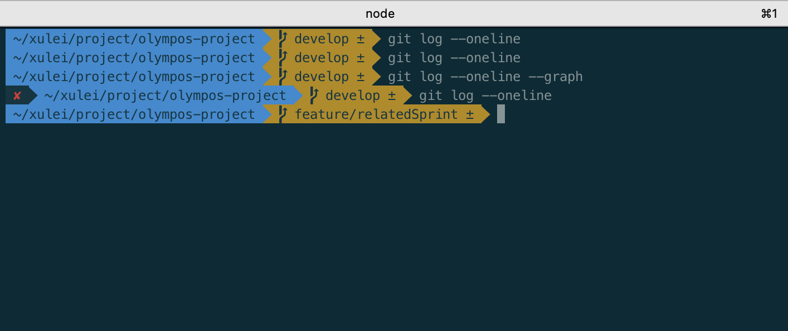

# 设置

- mac 访达中配置显示资源管理器 【访达-偏好设置-边栏】
- 在 finder 根目录中`command + shift + .`显示隐藏文件即可看到.同时可以看到 bash 、csh 、dash 、zsh 等都在这个目录下,

# 快捷键

- `⌘` : command = window
- `⌃` : control
- `⇧` : shift
- `⌥` : option = alt
- `⌫` : delete

| 快捷键                | 含义                                                  | window 命令        |
| :-------------------- | :---------------------------------------------------- | ------------------ |
| `⌘ + z`               | 回退                                                  | `ctrl + z`         |
| `⌘ + ⇧ + z`           | 撤销回退                                              | `ctrl + y`         |
| `⌘ + c, v, x, z, a`   | 复制、粘贴、剪切(文字剪切,不支持文件剪切)、撤销、全选 |
| `⌘ + n, t`            | 新建窗口、新建 Tab                                    |
| `⌘ + Q`               | 退出程序                                              |
| `⌘ + W`               | 关闭当前窗口，即点击窗口的左上角的红色按钮            |
| `⌘ + H`               | 仅隐藏当前窗口                                        |
| `⌘ + M`               | 最小化当前窗口到 Dock 栏，即点击窗口左上角的黄色按钮  |
| `⌘ + ⌃ + F`           | 全屏当前窗口，即点击窗口左上角的绿色按钮/再次按取消   |
| `⌘ + ⌥ + D`           | 开启/隐藏 程序坞                                      | `window + alt + D` |
| `⌃ + ⌥ + 空格键`      | 切换输入法                                            | `win + 空格`       |
| `⌘ + ←, →`            | 跳转至行首部、跳转至行尾                              |
| `⌘ + ⇧ + ←, →`        | 跳转至行首部、跳转至行尾 并 选中                      |
| `⌘ + ⌃ + Q`           | 锁屏                                                  | `win + shift + Q`  |
| `Control + ⌘ + Space` | 显示所有表情符号                                      |
| `Control + Space`     | 切换输入法/ 打开聚焦搜索（搜索应用）                  |
| `⌘ + R`               | 页面刷新                                              | `F5`               |
| `⌘ + shift + R`       | 硬性重新加载                                          |                    |
| 鼠标双击              | 选中单词                                              |
| 鼠标双击后拖动        | 连续选中单词                                          |
| 鼠标三击              | 选中一行                                              |
| 鼠标三击后拖动        | 连续选中一行                                          |
| ctrl+鼠标点击         | 相当于触摸板双指点击（即右键菜单）                    |
|                       | 程序界面全屏/取消                                     | `win+上/下箭头`    |

# 触摸板

| 快捷操作               | 含义                                         |
| :--------------------- | -------------------------------------------- |
| 单指单击               | 选择（等于鼠标左击，注意这一项没有默认开启） |
| 双指单击               | 显示菜单（等于鼠标右键）                     |
| 双指双击               | 放大缩小界面                                 |
| 双指拖动               | 滚动                                         |
| 双指捏合               | 放大缩小                                     |
| 双指左右轻扫           | 页面内翻页                                   |
| 三指左右拖动           | 切换全屏程序 = `control + 左右箭头`          |
| 三指向上轻扫           | 调度中心                                     |
| 三指向下轻扫           | app expose                                   |
| 捏拢拇指和其它三指     | 启动台                                       |
| 松开拇指和其它三指     | 显示桌面                                     |
| 反向捏拢拇指和其它三指 | 桌面各个任务栏移到边缘，空出全屏幕空间       |

# Chrome

| 命令             |       含义        | window 命令 |
| :--------------- | :---------------: | ----------: |
| `⌘ + T`          |   打开新标签页    |
| `⌘ + N`          |    打开新窗口     |
| `⌘ + Shift + N ` | 打开新的无痕窗口  |
| `⌘ + ⇧ + F`      | chrome 标签全屏幕 |

# 开发

| 命令               |                含义                 |              window 命令 |
| :----------------- | :---------------------------------: | -----------------------: | --------------------- |
| `⌘ + 点击`         |              跳转详情               |
| `⌃ + -`            |        后退(返回上一处光标)         |
| `⌃ + shift + -`    |        前进(返回下一处光标)         |
| `⌘ + ⇧ + F`        |          chrome 标签全屏幕          |
| `⌘ + ⌥ + 左右箭头` |     chrome/vscode 切换左右标签      |
| `⌘ + ⌃ + 左右箭头` |      vscode 标签移动到左右窗口      |
| `⌥ + ⌘ + I`        |             开发者工具              |              `win+alt+I` |
| `⌃ + tab`          |  切换到下一个 chrome/vscode 标签页  |          `control + tab` |
| `⌃ + ⇧ + tab`      | 切换到上一个 chrome/vscode 标签页面 |  `control + shift + tab` |
| `⌘ +               |                  `                  | vscode 当前 Tab 向右拆分 |
| `⇧ + Q`            |          退出 git 详情界面          |
| `⌃ + C`            |            退出项目编译             |
| `⌘ + R`            |              普通刷新               |
| `⌘ + shift + R`    |              强制刷新               |
| `⌘ + shift + C`    |        切换 选取分析页面元素        |
| `⇧ + Tab`          |              回退 Tab               |
| `⌘ + 回车`         |       在当前行下一行添加新行        |            `win + enter` |
| `⌘ + ⇧ + 回车`     |       在当前行下一行添加新行        |                          | `win + shift + enter` |

# 开发工具

| 命令             |    含义    | window 命令 |
| :--------------- | :--------: | ----------: |
| `⇧ + ⌘ + F`      |  全局搜索  |
| `⇧ + ⌥ + F`      | 格式化代码 |          `` |
| `⇧ + ⌥ + 上箭头` | 向上复制行 |          `` |
| `⇧ + ⌥ + 下箭头` | 向下复制行 |          `` |
| `⌥ + 上箭头`     | 向上移动行 |          `` |
| `⌥ + 下箭头`     | 向下移动行 |          `` |

## Git

- 要想在 mac 上使用 git 必须要下个 command Line Tools，链接见参考链接，下载安装完成后就可以直接用 git
  - `xcode-select --install` 验证是否安装了 command-line-tools，安装后显示 ·`code-select: error: command line tools are already installed, use "Software Update" to install updates`
- 生成 SSHkey
  - `ssh-keygen -t rsa -C "xxxx@qq.com"`
  - `open /Users/xulei/.ssh/id_rsa.pub` 或者 `cat /Users/xulei/.ssh/id_rsa.pub` 打开 ˜

## iTerm2 快捷命令

| 命令                                    |      含义      |     |
| :-------------------------------------- | :------------: | --: |
| `command + t`                           |    新建标签    |
| `command + w`                           |    关闭标签    |
| `command + 数字 command + 左右方向键`   |    切换标签    |
| `command + enter`                       |    切换全屏    |
| `command + f`                           |      查找      |
| `command + d`                           |    垂直分屏    |
| `command + shift + d`                   |    水平分屏    |
| `command + option + 方向键 (command +)` |    切换屏幕    |
| `command + ;`                           |  查看历史命令  |
| `command + shift + h`                   | 查看剪贴板历史 |
| `ctrl + u`                              |   清除当前行   |
| `ctrl + l`                              |      清屏      |
| `ctrl + a`                              |     到行首     |
| `ctrl + e`                              |     到行尾     |
| `ctrl + f/b`                            |    前进后退    |
| `ctrl + p`                              |   上一条命令   |
| `ctrl + r`                              |  搜索命令历史  |

## 软件

- 极简屏保程序：padbury clock

## 参考链接

- [MAC 上 Git 安装与 GitHub 基本使用](https://www.jianshu.com/p/7edb6b838a2e)
- [Homebrew 介绍和使用](https://www.jianshu.com/p/de6f1d2d37bf)
- [Mac OS 终端利器 iTerm2](https://www.cnblogs.com/xishuai/p/mac-iterm2.html)
- [vim 极为详细的教程（一）基本操作](https://zhuanlan.zhihu.com/p/149515175)
- [Mac 终端配置--iTerm2 + solarized 配色+ zsh + oh-my-zsh--小白教程](https://blog.csdn.net/H_Joyce/article/details/88851246)
- [Mac 下终端工具 iTerm2 安装](https://www.jianshu.com/p/ba08713c2b19)

# Windows

| 命令    |    含义    |     |
| :------ | :--------: | --: |
| `win+v` |   剪贴板   |
| `win+;` | 表情快捷键 |

# 参考链接

- [Mac OS X 安装软件的方法](https://www.jianshu.com/p/8e8fa582fada)
- [macOS 常用快捷键汇总（对比 Windows）](https://zhuanlan.zhihu.com/p/261844982)
- [苹果 mac 开发者下载](https://developer.apple.com/download/all/)
