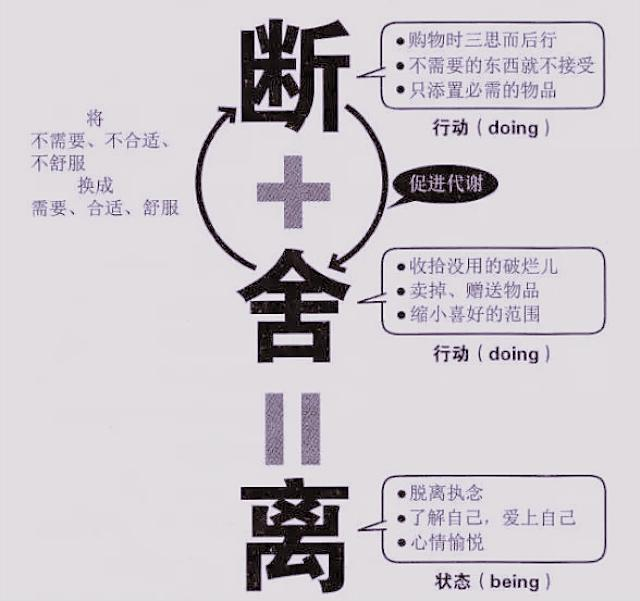

# 杂文集

## 断舍离

《断舍离》一书被引进国内后，销售高达两百万册，读者通过阅读与实践书中整理家居的方法，从而树立起健康的人生态度，与内在自我达成和解。深究“断舍离”三字，

==“断”便是断绝购买无用又昂贵的物品的欲望和想法。
“舍”便是舍弃或及时处理掉家中闲置的物品，除去多余之物；
“离”便是离开对已舍去事物的执念==。

山下英子的修行哲学“断行，舍行，离行”在此书内体现得淋漓尽致，“断舍离”的本质无非就是为生活做“减法”，为精神做“加法”。

==断等于不买、不收取不需要的东西；
舍等于处理掉堆放在家里没用的东西；
离等于舍弃对物质的迷恋，让自己处于宽敞舒适，自由自在的空间== 。

