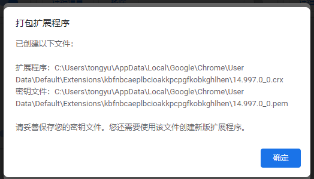

# Chrome 插件

## 如何导出扩展程序为 crx 文件？

> **背景：**
> 有时候，我们会因为 Chrome 应用商店访问不了，或某些 Chrome 扩展程序在 Chrome 应用商店已经下架等原因，需要将已经安装好的 Chrome 扩展程序导出成扩展程序安装包(.crx)，以便可以复制到其它电脑安装使用

> **步骤：**

- 【1】chrome 扩展程序 找到插件的 ID

- 【2】根据 ID 确定扩展程序/插件的安装目录
  `C:\Users\[用户]\AppData\Local\Google\Chrome\UserData\Default\Extensions\[插件ID: dhdgffkkebhmkfjojejmpbldmpobfkfo]\[版本]`

  示例：`C:\Users\tongyu\AppData\Local\Google\Chrome\User Data\Default\Extensions\dhdgffkkebhmkfjojejmpbldmpobfkfo`
- 【3】扩展程序界面开发者模式下有打包扩展程序功能
  根据【2】的目录填写到扩展程序根目录，选到版本文件夹。生成后如下。

# 参考资料

- [怎么从 Chrome 浏览器中导出扩展程序为 crx 文件？](http://www.cnplugins.com/tool/export-cnplugins-crx.html)

- [在线编辑器](https://codesandbox.io/s/z4g3m)