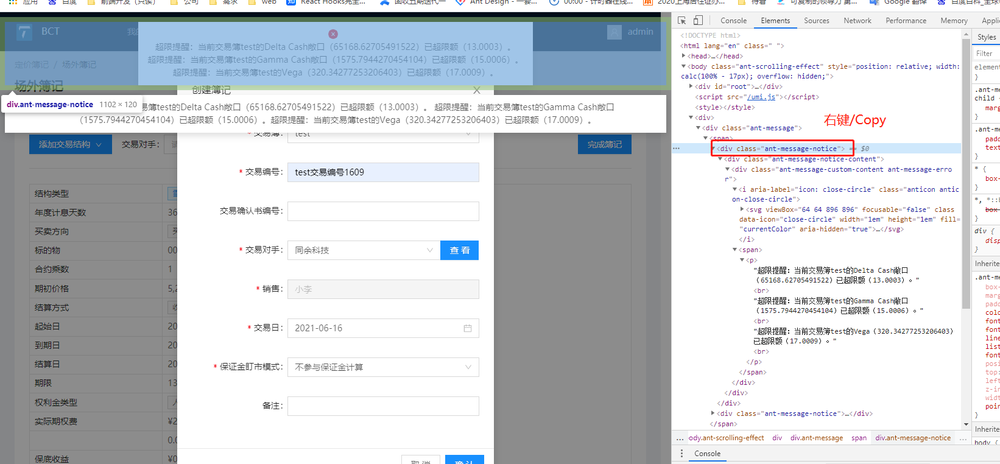
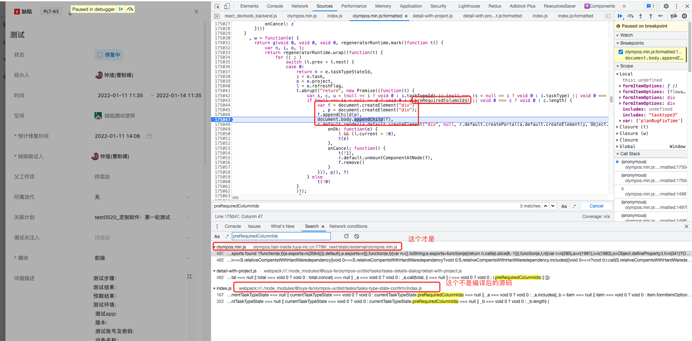
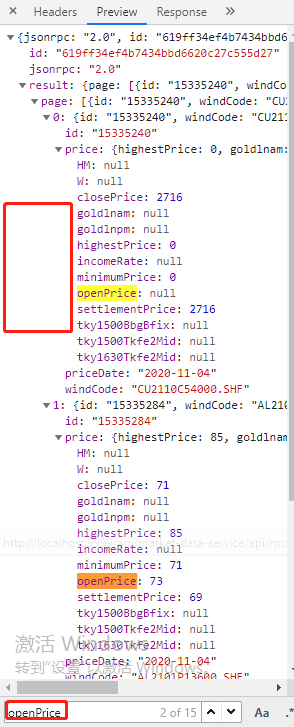

# 调试

- 在【开发者工具-element】中调试样式是很方便的

- 如下，鼠标点击【styles 里面的一个选择器】所选择的元素就能在界面上显示出来。
  

## Elements Dom 树

> 【如何知道 React 组件中哪个 state 或者 JSX 元素变化导致的重新 render】

操作，同时打开控制台 element，观察重新 render 时候，element 中哪些元素发生了高亮变化，即是哪个 jsx 元素发生了数据变化。

> 某些事件触发显示的 DOM 元素不好让其暂停显示查看 DOM 结构及样式，如 antd 的`message.info` 显示提示。

解决方案：找到其 DOM 节点，触发的瞬间快速的右键/copy/copy element。再编辑节点复制一下即可。效果如下。



# 手动添加 cookie

[Chrome 浏览器手动添加 Cookie 的方法](https://segmentfault.com/a/1190000040597170)

```jsx
document.cookie="keyName=cookeiValue"；
```

服务端请求可以看到携带了 cookie，但是浏览器请求头 headers 中没有携带 cookie，查看 cookie 栏，发现是被过滤掉了，提示如下
`this cookie was blocked because its path was not an exact match for or a superdirectory of the request url's path`
即：此 cookie 被阻止，因为它的路径与请求 url 的路径不完全匹配或超级目录

最终解决方法：

```js
1. 地址栏输入 chrome://flags/
2. 搜索 Partitioned cookies
3. 将其开关从default改成Enabled // 控制是否启用了 Partitioned cookie 属性
4. 重启chrome
5. 将cookie的path改成/
```

# 全局搜索

位置：`开发者工具-菜单-search`。

如下为项目内的源代码，在控制台全局搜索找到如下图。

```jsx
export const confirm = async (options: IOptions) => {
  // taskTypeId = 'tasktype3'
  // taskTypeStateId = 'state3'
  const { taskTypeStateId, task, project, refreshFlag } = options;
  return new Promise((resolve) => {
    const taskTypeId = task?.taskTypeId || task?.taskType?.id;
    const currentTaskTypeState = getCurrentTaskTypeState(
      taskTypeId,
      taskTypeStateId,
      project?.taskTypes
    );
    // 如 currentTaskTypeState 变量是自己定义的，所以编译之后会变成诸如a/b/m这种的变量，但是 下面的 currentTaskTypeState?.preRequiredColumnIds 中的 preRequiredColumnIds不会被编译，直接在Search中搜索就能发现浏览器中编译之后的代码，然后可以
    if (currentTaskTypeState?.preRequiredColumnIds?.length) {
      const nodeWrapper = document.createElement("div");
      const nodeInner = document.createElement("div");
      nodeWrapper.appendChild(nodeInner);
      document.body.appendChild(nodeWrapper);
      ReactDOM.render(
        <div>
          {ReactDOM.createPortal(
            <TasksTypeStateConfirm
              {...options}
              onOk={(values) => {
                refreshFlag && (refreshFlag.current = true);
                resolve(values);
              }}
              onCancel={() => {
                resolve(false);
                ReactDOM.unmountComponentAtNode(nodeWrapper);
                nodeWrapper.remove();
              }}
            />,
            nodeInner
          )}
        </div>,
        nodeWrapper
      );
    } else {
      resolve(true);
    }
  });
};

export default confirm;
```

这里就可以打断点了，就能知道走了哪些逻辑。判断出 bug 原因。


# 联调

## 请求接口响应内容字段在 `Preview` 和 `Response`中不一致

**【问题描述】：**
产品列表 ID 字段是 Number 类型，Response 中为`{..., "ID": 1329854122600030002, ...}`，而在 Preview 中却显示为`{..., "ID": 1329854122600030000, ...}`，即尾位显示有问题。代码中 console 打印数据显示为`ID: "1329854122600030002",..`，可以发现 console 打印的字段跟 Response 中的保持一致，但是类型却从`number`变成了`String`。

**【原因分析】：**

**【参考链接】：**

- [（2021-10-14）解决 JS 处理 api 返回 number 字段精度丢失问题](https://blog.csdn.net/zhangjunfun/article/details/120761177)
- [（2022-05-14）chrome 中 response 与 preview 数据不一致的问题](https://blog.csdn.net/HAN_789/article/details/124268068)
- [chrome 浏览器 preview 和 response 数据不一致](https://www.csdn.net/tags/MtTaMg5sMDY4MzU0LWJsb2cO0O0O.html)

## `NetWork`发送的请求在 postMan 测试

**【步骤】：**

- 右键接口-`Copy`-`Copy as cURL(Bash)`
- potman-`import`-`Raw text`-复制
- 可以修改 url、headers 字段，body 字段进行接口测试。

## 接口返回数据中的长 `number` 精度丢失需要加引号

**【问题描述】：**

项目中很多接口返回的 ID/Time 字段都是非常长的 number，容易精确丢失，所以 axios 配置处理接口数据的时候，将`【冒号】 + 【0/1个空格】+ 【至少16个数字】` 的字符串转换为 `"【至少16个数字】"`，即长数字变为字符串格式，

```js
(str) => JSON.parse(str.replace(/(?<=:\s?)(\d{16,})/g, '"$1"'));
// /(?<=【冒号】【0/1个空格】)(【至少16个数字】)/g
```

但是上面这个正则遇到`Cells`这种`长数字数组`格式的字段就没法成功匹配并处理了。可以发现如下代码，除了`Cells`别的长数字类型都转成了字符串，只有`Cells`没有转换成功。

```js
{
  // ...
  'ApprovalTime': "132435894696049686",
  'Cells': [1319554036000010000], // 只有`Cells`没有转换成功，且打印时是精度丢失了最后一位
  'CreateTime': "132143022596945009",
  'ID': "1321430225900030002",
  // ...
}
```

**【解决方法】：**

正则表达式修改成如下即可。

```js
(str) => JSON.parse(str.replace(/(?<=[:[,]\s?)(\d{16,})/g, '"$1"'));
// /(?<=【冒号或者左括号[或逗号,】【0/1个空格】)(【至少16个数字】)/g
// 再加一个逗号,因为Cells可能有多个元素
```

```js
{
  'ApprovalTime': "132435894696049686",
  'Cells': ["1319554036000010001"],
  'CreateTime': "132143022596945009",
  'ID': "1321430225900030002",
}
```

不可以用这个数据测试。（没法测，因为代码中和控制台中`stringifyListData`会精度缺失），只能通过接口返回数据去测，根据接口`Response`中的和最终打印出来的判断是否符合期望。

```js
const stringifyListData = JSON.stringify([
  {
    ApprovalTime: 132435894696049686,
    Cells: [1319554036000010001, 1319554036000010002],
    CreateTime: 132143054450453025,
    ID: 1321430544500030003,
  },
  {
    ApprovalTime: 132150652138469998,
    Cells: [1319554036000010001, 1319554036000010005],
    CreateTime: 132143054450453025,
    ID: 1321430544500030003,
  },
]);
```

**【出现新问题】：**

recipeDetail 的长 number 解析又有问题了，Cells 字段，如果值过多，就会解析不成功。原因是换行符。

```jsx
(config) => {
      try {
        const handledConfig = config?.replace?.(
          /(?<=[:[,])([\s\n\t\r]+)(\d{16,})/g,
          '"$2"',
        );
        // \n\t?\r?
        return handledConfig && JSON.parse(handledConfig);
      } catch (e) {
        console.error({
          message: 'transformResponse：JSON parsing error',
        });
      }
    },
```

# Tips-代码


## 元素按住拖动时`Elements`新增的元素如何查看其 DOM 结构和样式

**【问题描述】**

在使用依赖`react-sortable-hoc`实现趋势组件项目-`趋势分屏右侧表格支持行拖拽到左侧分屏数列功能`时，在元素按住拖动时`Elements`中能发现`<body>`体内最后新增了元素`<tr>`（记为`draggingTr`），且元素拖动过程中`<tr>`的样式`transfrom: translate3d(-40px, 72px, 0px)`一直随着拖动位置改变而改变`translate3d`的 x/y 值。说明`draggingTr`就是看到的`拖动ing行`。

**【需求】**
想查看下`draggingTr`的 DOM 结构，以及样式。但是由于拖动过程中没法松开鼠标，即没法在`Elements`中选中查看。

**【实现思路】**
借用`setTimeOut`异步任务来在拖动过程中去找到`draggingTr`，暂存其 DOM 结构以及样式。

```js
let dragingEleInfoObj = {};

// 控制台运行setTimeout后再开始拖动表格行
setTimeout(() => {
  dragingEleInfoObj.ele = document.body.lastChild;
  dragingEleInfoObj.eleComputedStyle = JSON.stringify(
    getComputedStyle(tempObj.ele)
  );
}, 5000);
```

打印`dragingEleInfoObj`如下。

```js
// dragingEleInfoObj.ele
<tr
  data-row-key="var://CM6.PID1.RRL.VALUE"
  style="box-sizing: border-box; height: 24px; left: 380px; pointer-events: none; position: fixed; top: 258px; width: 631px; transform: translate3d(-19px, 38px, 0px);"
  class="table-row-dragging"
>
  <td class="table-cell drag-visible table-cell-row-hover">
    <span
      role="img"
      aria-label="menu"
      class="anticon anticon-menu"
      style="color: rgb(153, 153, 153); cursor: grab;"
    >
      <svg
        viewBox="64 64 896 896"
        focusable="false"
        data-icon="menu"
        width="1em"
        height="1em"
        fill="currentColor"
        aria-hidden="true"
      >
        <path d="xxx"></path>
      </svg>
    </span>
  </td>
  <td
    class="table-cell drag-visible table-cell-ellipsis table-cell-row-hover"
    title="var://CM6.PID1.RRL.VALUE"
  >
    var://CM6.PID1.RRL.VALUE
  </td>
  <td
    class="table-cell drag-visible table-cell-ellipsis table-cell-row-hover"
    title=""
  ></td>
  <td class="table-cell drag-visible table-cell-row-hover">
    <div style="background-color: rgb(211, 242, 97); height: 18px; border-radius: 4px;"></div>
  </td>
  <td class="table-cell table-cell-row-hover">
    <div style="text-align: center; color: rgb(179, 127, 235); font-weight: 700;">
      1
    </div>
  </td>
</tr>
```

```js
// eleComputedStyle 对象
// JSON.parse(tempObj.eleComputedStyle)
```

## 空格键自动触发上一次的点击事件

在 chrome 浏览器访问网页，点击一个按钮事件后，不停的点击空格键，会不停的自动触发刚刚按钮的点击事件。

# Tips-工具

## 自带 screenshot 截图

【参考链接】

- [如何用 Chrome 进行截图(无需插件)](https://zhuanlan.zhihu.com/p/122816433)
- [电脑上网页截图，一个 Chrome 就够了](https://sspai.com/post/56833)

## 接口返回数据可以搜索

接口数据可以搜索，点开对象，点击空白处`ctrl + F`


# 问题
