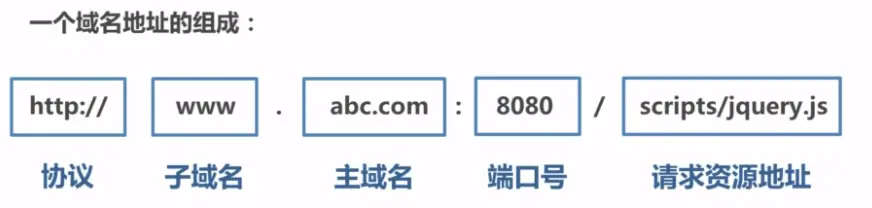
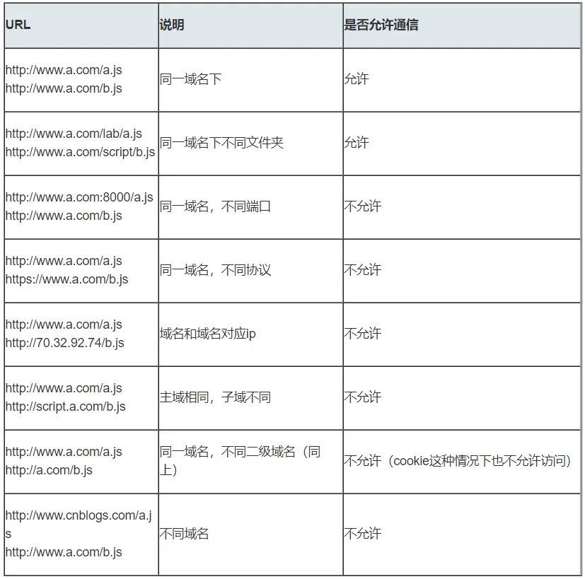

# 同源策略及其限制内容

同源策略是一种约定，它是浏览器最核心也最基本的安全功能，如果缺少了同源策略，浏览器很容易受到 XSS、CSRF 等攻击。**所谓同源是指"协议+域名+端口"三者相同，即便两个不同的域名指向同一个 ip 地址，也非同源**。



同源策略 共有三种行为受到限制。

> （1） **Cookie、LocalStorage 和 IndexDB 无法读取**。
> （2） **DOM 无法获得**。
> （3） **AJAX 请求不能发送**。

但是有三个标签是允许跨域加载资源：

> - ``
> - `<link href=XXX>`
> - `<script src=XXX>`

# 什么是跨域

**当协议、子域名、主域名、端口号中任意一个不相同时，都算作不同域。不同域之间相互请求资源，就算作“跨域”**。常见跨域场景如下图所示：



## 特点

特别说明两点：

- 第一：**如果是协议和端口造成的跨域问题“前台”是无能为力的**。
- 第二：在跨域问题上，**仅仅是通过“URL 的首部”来识别而不会根据域名对应的 IP 地址是否相同来判断。“URL 的首部”可以理解为“协议， 域名和端口必须匹配”**。

**这里你或许有个疑问：请求跨域了，那么请求到底发出去没有**？

**跨域并不是请求发不出去，请求能发出去，服务端能收到请求并正常返回结果，只是结果被浏览器拦截了**。你可能会疑问明明通过表单的方式可以发起跨域请求，为什么 Ajax 就不会?因为归根结底，跨域是为了阻止用户读取到另一个域名下的内容，Ajax 可以获取响应，浏览器认为这不安全，所以拦截了响应。**但是表单并不会获取新的内容，所以可以发起跨域请求。同时也说明了跨域并不能完全阻止 CSRF，因为请求毕竟是发出去了**

# 跨域时 cookie 问题

浏览器默认情况下无法主动跨域向后端发送 cookie，如果你要发送 cookie 给 server 的话，就需要将`withCredentials`设置为 true 了。

但是，server 并不是随便就能接受并返回新的 cookie 给你的。 在 server 端，还需要设置`Access-Control-Allow-Credentials: true`

这样 server 才能返回新的 cookie 给你。 但是，这还有一个问题，就是 cookie 还是遵循 `same-origin policy` 的。 所以， 你依旧无法使使用它。
最多是访问到它。即使你设置了 cors！

所以很多时候你能访问到 cookie，**即使在客户端做了修改它也不会改变，他的 CRUD 只能由 server 控制**。

# 跨域解决方案

## 1.jsonp

### 1.1 JSONP 原理

利用`<script>` 标签没有跨域限制的漏洞，网页可以得到从其他来源动态产生的 JSON 数据。JSONP 请求一定需要对方的服务器做支持才可以。

### 1.2 JSONP 和 AJAX 对比

JSONP 和 AJAX 相同，都是客户端向服务器端发送请求，从服务器端获取数据的方式。但 AJAX 属于同源策略，JSONP 属于非同源策略（跨域请求）

### 1.3 JSONP 优缺点

JSONP 优点是简单兼容性好，可用于解决主流浏览器的跨域数据访问的问题。**缺点是仅支持 get 方法具有局限性，不安全可能会遭受 XSS 攻击**。

### 1.4 JSONP 的实现流程

- 声明一个回调函数，其函数名(如 show)当做参数值，要传递给跨域请求数据的服务器，函数形参为要获取目标数据(服务器返回的 data)。
- 创建一个`<script>`标签，把那个跨域的 API 数据接口地址，赋值给 script 的 src，还要在这个地址中向服务器传递该函数名（可以通过问号传参:?callback=show）。
- 服务器接收到请求后，需要进行特殊的处理：把传递进来的函数名和它需要给你的数据拼接成一个字符串，例如：传递进去的函数名是 show，它准备好的数据是`show('我不爱你')`。
- 最后服务器把准备的数据通过 HTTP 协议返回给客户端，客户端再调用执行之前声明的回调函数（show），对返回的数据进行操作。

在开发中可能会遇到多个 JSONP 请求的回调函数名是相同的，这时候就需要自己封装一个 JSONP 函数。

```js
// index.html
function jsonp({ url, params, callback }) {
  return new Promise((resolve, reject) => {
    let script = document.createElement("script");
    window[callback] = function (data) {
      resolve(data);
      document.body.removeChild(script);
    };
    params = { ...params, callback }; // wd=b&callback=show
    let arrs = [];
    for (let key in params) {
      arrs.push(`${key}=${params[key]}`);
    }
    script.src = `${url}?${arrs.join("&")}`;
    document.body.appendChild(script);
  });
}
jsonp({
  url: "http://localhost:3000/say",
  params: { wd: "Iloveyou" },
  callback: "show",
}).then((data) => {
  console.log(data);
});
```

上面这段代码相当于向`http://localhost:3000/say?wd=Iloveyou&callback=show`这个地址请求数据，然后后台返回`show('我不爱你')`，最后会运行 show()这个函数，打印出'我不爱你'

```js
// server.js
let express = require("express");
let app = express();
app.get("/say", function (req, res) {
  let { wd, callback } = req.query;
  console.log(wd); // Iloveyou
  console.log(callback); // show
  res.end(`${callback}('我不爱你')`);
});
app.listen(3000);
```

### 1.5 jQuery 的 jsonp 形式

JSONP 都是 GET 和异步请求的，不存在其他的请求方式和同步请求，且 jQuery 默认就会给 JSONP 的请求清除缓存。

```js
$.ajax({
  url: "http://crossdomain.com/jsonServerResponse",
  dataType: "jsonp",
  type: "get", //可以省略
  jsonpCallback: "show", //->自定义传递给服务器的函数名，而不是使用jQuery自动生成的，可省略
  jsonp: "callback", //->把传递函数名的那个形参callback，可省略
  success: function (data) {
    console.log(data);
  },
});
```

## 2.cors

**CORS 需要浏览器和后端同时支持。IE 8 和 9 需要通过 XDomainRequest 来实现**。

浏览器会自动进行 CORS 通信，实现 CORS 通信的关键是后端。只要后端实现了 CORS，就实现了跨域。

服务端设置 `Access-Control-Allow-Origin` 就可以开启 CORS。 该属性表示哪些域名可以访问资源，如果设置通配符则表示所有网站都可以访问资源。

虽然设置 CORS 和前端没什么关系，但是通过这种方式解决跨域问题的话，会在发送请求时出现两种情况，分别为简单请求和复杂请求。

### 2.1 简单请求

只要同时满足以下两大条件，就属于简单请求
条件 1：使用下列方法之一：

- `GET`
- `HEAD`
- `POST`

条件 2：Content-Type 的值仅限于下列三者之一：

- `text/plain`
- `multipart/form-data`
- `application/x-www-form-urlencoded`

请求中的任意 `XMLHttpRequestUpload` 对象均没有注册任何事件监听器； `XMLHttpRequestUpload` 对象可以使用 `XMLHttpRequest.upload` 属性访问。

### 2.2 复杂请求

不符合以上条件的请求就肯定是复杂请求了。

**复杂请求的 CORS 请求，会在正式通信之前，增加一次 HTTP 查询请求，称为"预检"请求，该请求是 option 方法的，通过该请求来知道服务端是否允许跨域请求**。

我们用 PUT 向后台请求时，属于复杂请求，后台需做如下配置：

```js
// 允许哪个方法访问我
res.setHeader("Access-Control-Allow-Methods", "PUT");
// 预检的存活时间
res.setHeader("Access-Control-Max-Age", 6);
// OPTIONS请求不做任何处理
if (req.method === "OPTIONS") {
  res.end();
}
// 定义后台返回的内容
app.put("/getData", function (req, res) {
  console.log(req.headers);
  res.end("我不爱你");
});
```

接下来我们看下一个完整复杂请求的例子，并且介绍下 CORS 请求相关的字段

```js
// index.html
let xhr = new XMLHttpRequest();
document.cookie = "name=xiamen"; // cookie不能跨域
xhr.withCredentials = true; // 前端设置是否带cookie
xhr.open("PUT", "http://localhost:4000/getData", true);
xhr.setRequestHeader("name", "xiamen");
xhr.onreadystatechange = function () {
  if (xhr.readyState === 4) {
    if ((xhr.status >= 200 && xhr.status < 300) || xhr.status === 304) {
      console.log(xhr.response);
      //得到响应头，后台需设置Access-Control-Expose-Headers
      console.log(xhr.getResponseHeader("name"));
    }
  }
};
xhr.send();
```

```js
//server1.js
let express = require("express");
let app = express();
app.use(express.static(__dirname));
app.listen(3000);
```

```js
//server2.js
let express = require("express");
let app = express();
let whitList = ["http://localhost:3000"]; //设置白名单
app.use(function (req, res, next) {
  let origin = req.headers.origin;
  if (whitList.includes(origin)) {
    // 设置哪个源可以访问我
    res.setHeader("Access-Control-Allow-Origin", origin);
    // 允许携带哪个头访问我
    res.setHeader("Access-Control-Allow-Headers", "name");
    // 允许哪个方法访问我
    res.setHeader("Access-Control-Allow-Methods", "PUT");
    // 允许携带cookie
    res.setHeader("Access-Control-Allow-Credentials", true);
    // 预检的存活时间
    res.setHeader("Access-Control-Max-Age", 6);
    // 允许返回的头
    res.setHeader("Access-Control-Expose-Headers", "name");
    if (req.method === "OPTIONS") {
      res.end(); // OPTIONS请求不做任何处理
    }
  }
  next();
});
app.put("/getData", function (req, res) {
  console.log(req.headers);
  res.setHeader("name", "jw"); //返回一个响应头，后台需设置
  res.end("我不爱你");
});
app.get("/getData", function (req, res) {
  console.log(req.headers);
  res.end("我不爱你");
});
app.use(express.static(__dirname));
app.listen(4000);
```

上述代码由`http://localhost:3000/index.html`向`http://localhost:4000/`跨域请求，正如我们上面所说的，后端是实现 CORS 通信的关键。

## TOdo

# 参考资料

- [九种跨域方式实现原理（完整版）](https://juejin.cn/post/6844903767226351623#heading-12)
  - 里面说的 CORS 跟阮一峰的对比，高下立见
- [跨域资源共享 CORS 详解-阮一峰](http://www.ruanyifeng.com/blog/2016/04/cors.html)
