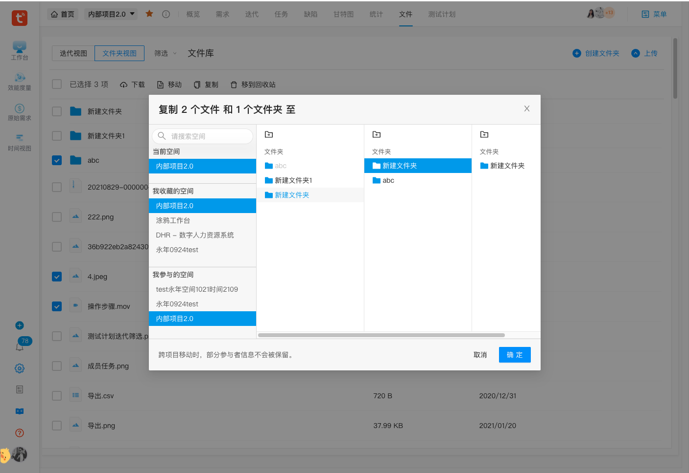
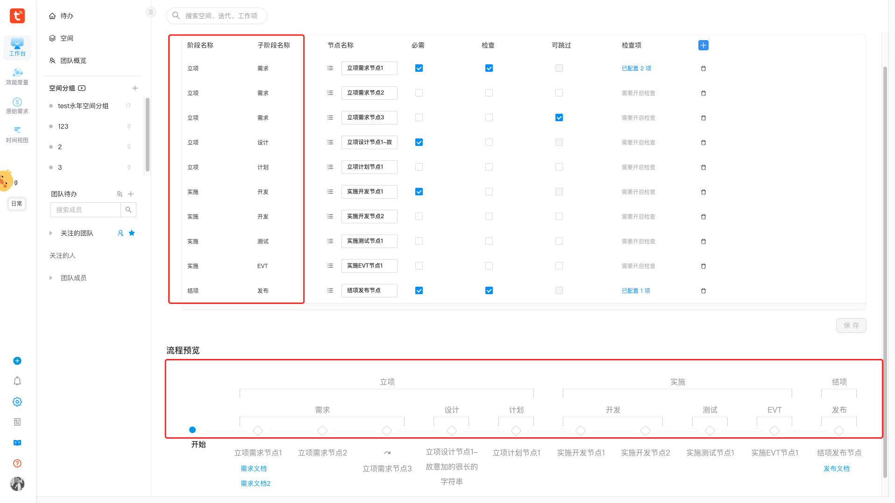

## 个人信息

- 姓名：徐磊
- 出生年月：1996.11.30
- 工作经验：4 年前端 React 项目开发经验
- Github：https://github.com/leoXuLei
- 期望岗位：Web 前端开发工程师
- 期望薪资：面谈
- 期望城市：杭州
- 联系方式：
  - 手机：15722928126
  - 邮箱：1611928589@qq.com
  - 微信：xl1611928589

## 教育背景

- 2014.09 ~ 2018.06&emsp;&emsp;南京邮电大学 / 软件工程 / 本科

<!-- **工作内容包括：** 需求移交理解、静态页面绘制、功能逻辑开发、接口联调对接、Bug 修复代码优化、参与推动项目进行等。 -->

## 技能清单

- 熟悉 HTML、CSS、JS、ES6、TypeScript，了解 HTML5、CSS3 新特性。
- 熟悉 React、Hooks、Dva、Redux 等相关技术栈。
- 熟悉 Antd 组件库，能够基于 Antd 封装复杂 UI/业务组件。
- 熟悉使用 sass、styled-components、lodash、xlsx、moment、bignumber 等库。
- 熟悉使用 Echarts 等可视化图表库开发各种图表。使用过 Canvas 绘制海报。
- 熟悉使用版本控制工具 Git/Gitlab。
- 了解 Webpack，能够从零开始搭建配置 React 项目开发环境。
- 了解前端性能优化、代码优化，致力于提高产品性能和用户体验。
- 了解基本数据结构和算法。了解面向对象编程思想。

## 项目经历

### 内部项目 V2.0 系统

**项目描述：** 该系统定位是项目管理、团队协作工具（类似于 Jira、Teambition），该系统提供了从“需求->开发->测试->发布->运营”端到端的协同服务和研发工具，可视化的项目进展和协作，井然有序的任务管理，旨在打造端到端一体化的研发协作流程。助⼒开发者提升研发效能，持续快速交付有效价值。系统用户为公司内各个产品、部门的 PM、研发、测试等。

**内容职责：** 参与项目的前端开发，配合产品、前后端协作，参与推动项目开发迭代流程（需求评审、技术评审、任务拆分估时、早会同步进度暴露问题、开发自测联调、测试、上线）。主要负责参与的功能模块有：

- 效能度量报表（表单查询、表格和图表切换展示及导出、数据公式、权限控制）
- 空间
  - 成员管理（新增移除、权限设置、任务转交）
  - 里程碑管理（节点新增父/子阶段属性，可编辑节点表格限制阶段内可拖动调整顺序，**预览 Steps 中标识展示节点的父/子阶段**）
  - 文件管理（新增迭代视图、**新增文件/文件夹复制/移动到目标文件夹**、新增文件标签设置）
- 迭代页（列表支持拖动调整宽度、列表数据繁杂响应慢改成分两次请求配合骨架屏、详情跳转自动展开并滚到视区）
- 工作项：需求、任务、缺陷、里程碑及对应的详情弹窗（工作项自定义表单控件如关联内容、关联项目、代码模块等，工作项动态日志、评论）
- 管理后台：业务线组织架构管理（人员、空间）、任务转交
- 每日待办、离职待转交弹窗：工作项、审批项、里程碑
    <!-- - 其它：视频图片引导、kong 网关配置 -->
    <!-- - 设置节点的顺序、必填、跳过、检查项/审批项 -->
  <!-- **工作内容个人职责：** -->

**技术栈：** 基于 React 技术栈的 next 项目，Hooks、TS、Antd、react-dnd、styled-components 等。

**难点收获：**

- 项目庞大、业务逻辑复杂：

  - 为保证项目模块清晰、易于扩展维护，项目采用微前端架构，整个项目被拆分为一个主项目，九个子项目，其中有一个子项目为组件库，一个子项目是 Git submodule ，为类型申明及少量组件库。各个子应用可独立开发、部署测试、交付上线。
  - 各空间的工作项的类型、字段、状态流程可配置。
    - 具体字段的 name、key、options、rules 可配置
    - 每个状态的可变更状态可配置

- 项目开发迭代流程规范标准，迭代节奏稳定可控。
- 作为项目管理工具的开发者同时也是使用者，对软件研发管理流程有了更深刻的认识和理解。
- 项目使用 Hooks 和 TS，之前都是写 Class 组件，有一定学习上手成本。
- 内部项目 UI 交互的细节不明确，需要自己去思考、设计、权衡。
  <!-- - 内部项目管理系统的用户都是公司内部团队，会有定制化需求掺杂在日常迭代中，日常还需要处理用户反馈、答疑等。 -->
  <!-- - 为保证项目模块清晰、易于扩展维护，项目采用微前端架构，整个项目被拆分为一个主项目（容器应用，将各个子应用集成起来），数十个子项目，其中一个子项目是组件库，作为 UI/业务组件库供所有项目使用，公共状态（如登录用户信息、角色权限信息等）也会保存在主应用中，子应用可共享。各个子应用可独立开发、部署测试、交付上线。 -->

### 结构金融管理系统

**项目描述：** 该系统是为了解决客户业务流程：产品发行管理（产品录入、流程审批、合约生成、用印归档等）、产品存续期管理（生命周期事件、计算统计、报告管理等）、资产管理（资产录入、到期兑付、核算收益等）等遇到的记录统计分析难度大、流程不规范、操作风险高、发行效率低、管理难度大等业务难点痛点。
**内容职责：** 独立负责国泰君安证券结构金融五期项目的前端开发。同产品、多名后端协作开发，能够独立解决开发中遇到的问题。
**技术栈：** React、Hooks、Umi、Antd、lodash、bignumber、moment、xlsx 等。
**难点收获：**

- 重构产品录入模块时通过模块化可配置设计解决了以下难点:

  - 各种期权结构产品字段数量多（ 60- 80 个控件）。
  - 除手动录入外还需支持 Excel 导入（数据映射、异常校验、容错处理）。
  - 大量控件的编辑控制、展示与否联动、控件值联动/校验、自定义控件封装、提交校验确认等。

  <!-- ==最终采用模块化可配置的方案: 根据产品关键字段期权结构将各期权结构的对应字段通过以期权结构为 key， 对应字段为 value 的字典形式管理，字段对应控件，控件统一管理==。 -->

- 用户使用体验优化：

  - 收益凭证列表表格列 150 个字段为了显示美观、使用友好，实现表格列显示配置（支持筛选、勾选、全选、按模块要素批量勾选/反选）及配置本地持久化保存功能。

- 在具体业务场景中，开发者需要思考：如何设计组织实现功能、降低代码耦合性、提高复用性和可维护性。
- 思考业务需求压力、代码质量把控、开发效率之间的制约关系。
<!-- - 初次接触逻辑复杂流程繁琐的收益凭证业务，需同产品、后端紧密沟通交流反馈。 -->

<!-- 虽然项目中使用的是已经封装完善经过其它项目实践过的模块/组件。但 -->

### 场外衍生品交易管理系统（BCT）

**内容职责：** 参与 BCT 光大证券、申万证券等多个项目的前端开发迭代。参与的模块/功能有：审批组管理、风控设置、簿记和试定价页面添加期权结构及要素等。
**难点：** 导出数据权限树形数据为包含样式的 Excel(支持任意层级树形数据导出、导出的 Excel 支持行列合并和定制样式)。

### 巧客力小程序项目

**项目描述：** 该微信小程序是房源管理维系客户的工具。具体功能有：房源新建管理、在线聊天、房源分享（分享好友、朋友圈、房源海报）、访客管理、小组管理、名片模板管理等。用户为房产经纪人。
**内容职责：** 同产品、前后端、测试协同开发，参与推动项目迭代进程。主要负责参与的功能模块有：房源详情、房源海报、房源采集、小组、会员、在线支付等。
**技术栈：** React、Dva、Taro、Canvas 等。
**难点收获：**

- 遇到的难点有 Canvas 绘制房源海报功能、在线支付功能。
- 随着开发维护的模块业务逻辑不断增加糅合，逐渐意识到了抽离、封装、复用代码的重要性。

### 巧房 V20 系统项目

**项目描述：** PC 项目 V20 SaaS 系统，致力于提升房产中介运营及管理效率。系统功能有交易订单管理、营销房源发布、业绩查询、行程量数据统计、财务结算等。
**内容职责：**

- 参与地图找房模块的开发，页面调用百度地图 API，通过缩放拖拽地图实现在城区、商圈、楼盘三个层级下聚合点位、多边形覆盖物的展示和交互效果及画圈找房功能。
- 负责考勤组设置、班次设置模块开发。后端提供的是基础接口，BFF 层需要前端处理，把多个基础接口数据处理成可用数据。
- 参与商圈精耕地图模块开发。

**技术栈：** React、Dva、Antd。

<!-- ### CRM5 项目
参与上海证券、海通证券等 CRM5 项目。页面多为表单表格和各种形式的图表数据展示。技术栈：React、Dva、Antd、Echarts 等。
**项目描述：** 系统多为表单表格、各种形式的图表数据展示。
**内容职责：** 根据页面 UI 图进行结构布局、功能逻辑实现、接口联调对接、测试优化等。
**技术栈：** React、Dva、Antd、Echarts 等。 -->

<!-- ##

### 江苏金陵科技公司前端实习生

测试工作：不能盲目开展，任何测试都应该以需求为基础，以测试用例为导向进行实施，
自动化测试与手工测试：自动化测试代替不了手工测试，目的仅仅在于让测试人员从繁琐重复的机械式测试过程解脱出来，把时间和精力投入到更有价值的地方，从而挖掘更多的产品缺陷，

编写 Python 脚本操作数据库是用的 sqlite
 -->

## 工作经历

- 2021/07 ~ 2022/03&emsp;&emsp;&emsp;杭州涂鸦信息技术有限公司

  - 业务：全球化物联网开发平台服务商
  - 部门：效能部
  <!-- - 离职原因：裁员 -->

- 2020/03 ~ 2021/06&emsp;&emsp;&emsp;上海同余信息科技有限公司
  - 业务：金融衍生品基础服务
  - 部门：解决方案部 BCT-Y 组
  <!-- - 离职原因：个人发展、职业规划 -->
- 2018/06 ~ 2020/01&emsp;&emsp;&emsp;上海巧房信息科技有限公司
  - 业务：房产 SaaS 系统
  - 部门：研发二部
  <!-- - 离职原因：裁员 -->

<!-- 证明人: 姚长剑 `13758296595`
证明人: 胡亚 `17802595052`
证明人: 神嘉熙 `13560300783` -->

<!-- - 说辞：毕业之后去的巧房，在小程序项目干了8个月 -->

<!-- - 2018/06 ~ 2019/06&emsp;&emsp;&emsp;上海顶点软件股份有限公司
  - 业务：金融 CRM 系统
  - 部门：华东交付零售线
  - 离职原因：团队变动、职业规划 -->

## 职业规划

本人具备一定的抗压能力、学习能力、团队协作沟通能力。近四年的前端开发工作经历使得我的专业技能得到了提升，能够参与并推动前端项目的开发迭代流程， 但距离成为一名优秀的高级前端开发工程师还需要项目积累和技术沉淀，比如基于业务场景封装组件/模块、封装自己的组件库/项目脚手架、前端工程化、数据结构和算法等方面都有待加强。希望不久的将来能熟练使用前端相关技术栈解决具体业务问题、推动项目进程、发挥前端职业价值、提升个人竞争力。

<!-- ## 项目展示

 -->

<!--
## 行情薪资

- 姚长剑
  - 后端
  - 16 年毕业：6 年经验
  - 恒生电子：28K 公积金全额，社保基数 4K 多
  - 在涂鸦：23K，
- 梁成
  - 后端
  - 绿城服务：22K\*15，
- 北冥
  - 前端，硕士
  - 18 年毕业：
  - 涂鸦：25K -->
